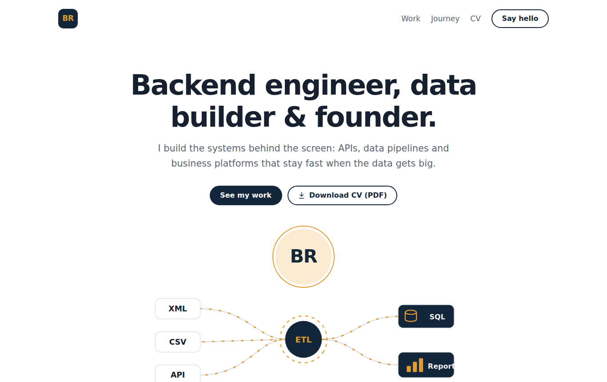

<div align="center">

# Bildad Cheruiyot Ronoh

**Backend engineer · Data & AI engineer · Founder**

I build APIs, data pipelines and business platforms that stay fast when the data gets big.

[**View portfolio**](https://billrawknow.github.io) &nbsp;|&nbsp;
[**Europass CV**](https://billrawknow.github.io/cv.html) &nbsp;|&nbsp;
[**Download CV (PDF)**](https://billrawknow.github.io/cv.html?print=1)

[](https://www.linkedin.com/in/bildad-ronoh/)
[](https://x.com/RawknowCheru)
[](mailto:bildadronoh@gmail.com)



</div>

## About

I'm a software developer based in Nairobi, Kenya, working mainly with **Java / Spring Boot**, **TypeScript / Node.js** and **Python**.

My work spans telecom asset lifecycle management systems for Gulf and East African operators, ETL pipelines for Huawei, Nokia and Cisco network data, ML and NLP pipelines, and business platforms for clients. I also run Rawknow Company Ltd, an IT and computer hardware business, and build my own products for African markets.

## Highlights

- **57 s → under 1 s:** cut a critical enterprise API's response time through query tuning, refactoring and caching.
- **10.15 s → under 50 ms:** made an ALM metrics dashboard service fast with parallel queries, indexing and caching.
- **1.2M+ records:** ran large-scale imports and ETL across MySQL, Oracle, PostgreSQL and MSSQL.
- **End-to-end client builds:** a multi-tenant quotation platform, a hardware store POS with thermal receipt printing and M-Pesa references, and a marketing site with a full CMS.

## Tech stack

| Area | Tools |
| --- | --- |
| Languages | Java, Python, TypeScript, JavaScript, SQL |
| Backend | Spring Boot, Spring Security, WebFlux, JPA / Hibernate, Node.js, Fastify, GraphQL |
| Data & AI | ETL pipelines, batch processing, scikit-learn, NLP |
| Databases | PostgreSQL, MySQL, Oracle, MSSQL, MongoDB |
| Frontend | React, Next.js |
| DevOps | Docker, Linux, Git, CI/CD |

## About this repository

This repository is the source of my portfolio site. It's a static site with no framework and no build step:

- `index.html`: the portfolio page.
- `cv.html`: a CV in the **Europass** layout, formatted for A4 so visitors can save it as a PDF from the browser.
- `data.js`: all the content in one file. Both pages render from it, so the site and the CV always match.

The pages work on phones, follow the system light or dark theme, and respect reduced-motion settings.

### Run locally

```bash
git clone https://github.com/Billrawknow/Billrawknow.github.io.git
cd Billrawknow.github.io
```

Then open `index.html` in a browser, or use the VS Code **Live Server** extension for live reload.

## Contact

I'm open to backend, data engineering and full-stack roles, as well as freelance projects.

- **Email:** [bildadronoh@gmail.com](mailto:bildadronoh@gmail.com)
- **LinkedIn:** [linkedin.com/in/bildad-ronoh](https://www.linkedin.com/in/bildad-ronoh/)
- **GitHub:** [@Billrawknow](https://github.com/Billrawknow)

---

© Bildad Cheruiyot Ronoh. The code is free to look at for ideas; please don't reuse the content or personal details.
